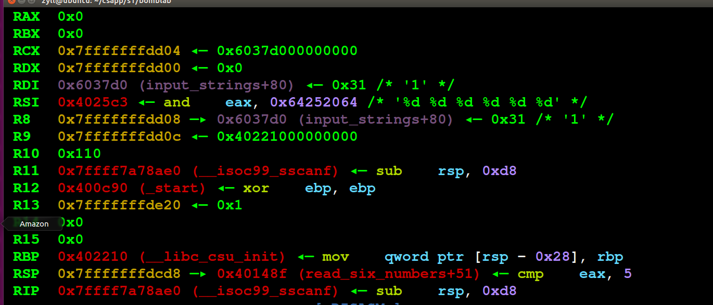
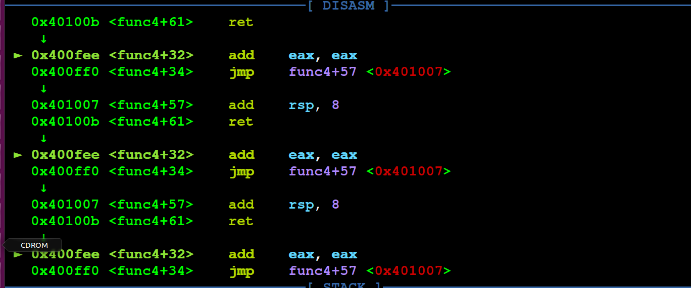
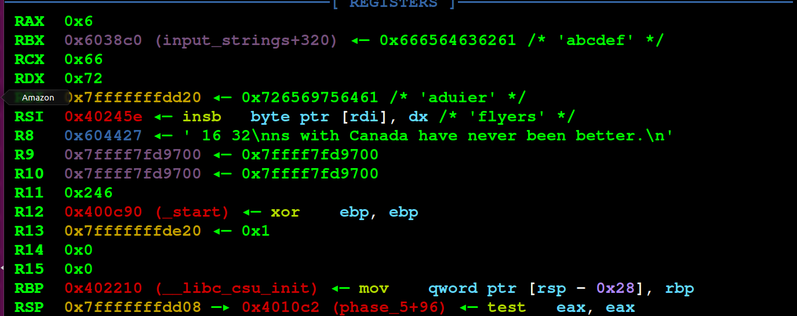
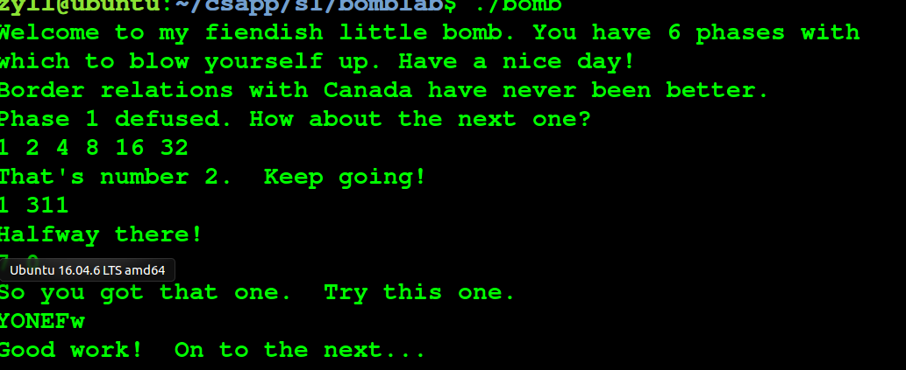

## BOMB-lab

答案

```
Border relations with Canada have never been better.

1 2 4 8 16 32

0 0xcf
1 0x137
2 0x2c3
3 0x100
4 0x185
5 0xce
6 0x2aa
7 0x147

7 0

YONEFw

4 3 2 1 6 5 
```

跳转汇编指令

```
INC 自增1   increase
DEC 自减1  decrease
JGE 前>=后  Jump if  greater or equal
JG 前>后   Jump if  greater
JLE 前<=后  Jump if  less or equal
JL 前<后  Jump if  less
JNE 前不等于后  Jump if not equal
JE 前等于后  Jump if equal
JBE 前小于等于 Jump if less or equal
```

二进制炸弹篇章，需要输入正确的字符串才能拆除炸弹， 当每一个阶段都被拆除时，炸弹才算拆除。 

### 炸弹一

#### ida汇编


如果程序最后运行到0400EF2 机会爆炸，所以要让eax=1，让程序跳转到loc_400EF7就行

刚开始是rsp=rsp-8，然后进入strings_not_equal


```
把r12 rbp rbx压入栈中
rbx=rdi
rbp=rsi
call   string_length 判断输入是否为0，为0就结束
r12d=eax
rdi=rbp
call   string_length 判断rdi是否为0，为0就结束
edx=1
判断r12d是否等于eax=1，如果等于1，eax=edx
输入的每个字节附给eax
判断a1是否为0，为0就失败
判断a1和rbp是否相等，不相等就跳转失败，相等，eax=1，程序成功
```

所以总体上来总结，就是我们输入的字符串存到rdi中，然后和rsi的每一位进行比较，都一样才行，所以再查看rsi存的字符串就行了 


```
Border relations with Canada have never been better.
```


call   string_length


```
如果输入的字符串为空，则eax=0，程序失败
不为0，则rdx=rdi=rbx
```


#### gdb调试

gdb常用指令

```
ni逐进程，按enter可以一直调试
n只能调试一次
si进入函数内部，按enter一直逐语句走调试
s进入函数内部，只能走一句
下断点 b *0x地址
start 开始调试
r或run运行程序
info b 查看断点
delete +断点编号 删除断点
```


运行程序

```
gdb bomb
start
```


0401338处下断点，然后r运行，ni过进程，


和ida一样，每一位进行比较


### 炸弹二

#### ida汇编


最后rsp要等于1，程序成功

```
把rbp，rbx压入栈中
rsp=rsp-40
rsi=rsp
rsp=rsp+24
判断rsp是否等于1，等于1就跳转到loc_400F30，否则失败
```


read_six_numbers函数


```
rsp=rsp-0x18
rdx=rsi
rcx= *(rsi+4)
rax= *(rsi+20)
*(rsp+8)=rax
rax=*(rsi+16)
rsp=rax
r9=*(rsi+12)
r8=*(rsi+8)
esi= 4个%d
eax=0
call ___isoc99_sscanf 输入数据
比较eax是大于5，如果大于5，就rsp=rsp+24，否则失败

```


loc_400F30


```
rbx=*(rsp+4)
rbp=*(rsp+24)
跳转到loc_400F17
```


loc_400F17


```
eax=*(rbx-4)
eax=eax*2
判断rbx是否等于eax，等于就跳转到loc_400F25，否则失败
```


loc_400F25


```
rbx=rbx+4
判断rbx是否等于rbp，不等于就再跳回去，循环，等于就跳到loc_400F3C
```


loc_400F3C


```
rsp=rsp+40
```


所以总结就是rsp是我们输入的数据，先判断第一个数据是否为1，为1就继续执行，如果输入的个数小于5，就失败，然后判断后一个数是否为前一个数的两倍，如果是，就成功，所以，应该输入的数是

```
1 2 4 8 16 32
```


#### gdb调试

在400EFC下断点

```
b *0x400EFC
start
```

 


输入6个数据


判断是否少于5个数据




结果


### 炸弹三

#### ida汇编


```
rsp=rsp-24
rcx=*(rsp+12)
rdx=*(rsp+8)
两个%d
eax=0
输入数据
判断输入的数据是否大于1个，不大于就失败
跳转到loc_400F6A
```


```
判断*(rsp+8)是否小于等于于7，大于7就失败
eax=*(rsp+8)
跳到 jpt_400F75
```


8个switch对应的部分


对应的8个数


最后8个switch都跳到了loc_400FBE


判断eax和rsp是否相等，相等就跳到loc_400FC9，不相等就失败

这7个数是里面对应的数

```
 207 707 256 389 206 682 327 
```


没有成功


又看了一下，应该这样，switch从0到7，然后0到7分别对应另一个数，一共又8种情况


#### gdb调试

```
b *0x400F43 
start
```

我们需要动调出它对应的值


按s进入函数，得到1对应的是137，解决了

再把其他对应的数字也调出来，得到

```
0 0xcf
1 0x137
2 0x2c3
3 0x100
4 0x185
5 0xce
6 0x2aa
7 0x147
```


### 炸弹四

#### ida汇编


还是需要输入2个符合要求的数字

```
rsp=rsp-24
rcx=*(rcx+12)
rdx=*(rsp+8)
两个%d
eax=0
输入数字，判断输入的数字是否为2个，不是就输出失败
判断第一个数是否小于等于14，如果是则跳转到loc_40103A
```


loc_40103A


```
edx=14
esi=0
edi=*(rsp+8)
call    func4 
判断返回值eax是否为0，如果是0就失败
判断*(rsp+12)是否为0，如果是就跳到loc_40105D

```


func4


```
rsp=rsp-8
eax=edx
eax=eax-esi
ecx=eax
向右移31位，就是取符号位，存到ecx里
eax=eax+ecx
算数右移1位
ecx=rax+rsi
判断ecx是小于等于edi，如果是，就跳到loc_400FF2
edx=*(rcx-1)
循环
eax=eax*2
跳到loc_401007

```


 分析得到%eax不能取到0xf，%edx作为循环变量，控制循环次数为0xf次，每次循环%ecx都加上%eax的值 ， 算术右移一位,即求(high-low)/2 

把funk4部分写成代码

```
int func4(int target, int step, int limit) {
  /* edi = target; esi = step; edx = limit */
  int temp = (limit - step) * 0.5;
  int mid = temp + step;
  if (mid > target) {
    limit = mid - 1;
    int ret1 = func4(target, step, limit);
    return 2 * ret1;
  } else {
    if (mid >= target) {
      return 0;
    } else {
      step = mid + 1;
      int ret2 = func4(target, step, limit);
      return (2 * ret2 + 1);
    }
  }
}
```

 所以答案是7 0


#### gdb调试


```
b *0x40100C
start
```





### 炸弹5

#### ida汇编


```
rbx压入栈中
rsp=rsp-32
rbx=rdi
rax=40
*(rsp+24)=rax
eax=0
call string_length
判断eax是否小于等于6，如果大于6就失败
```


string_length


```
判断第一位是否为0，为0就失败
rdx=rdi
```


loc_40108B


```
rbx+rax的每一位附给ecx
rsp=cl
rdx=rsp
eax和15做与运算
把rdx的每一位附给edx
*(rsp+rax+16)=dl
rax和1做与运算
判断rax是否大于6，不大于6就再跳回这个函数的初始位置
*(rsp+22)=0
esi='flyers'
rdi=*(rsp+16)
call    strings_not_equal
判断eax是否为0，如果是0，就跳到loc_4010D9，否则爆炸
```


strings_not_equal


```
把r12 rbp rbx 压入栈中
rbx=rdi
rbp=rsi
call    string_length
r12d=eax
rdi=rbp
call    string_length
edx=1
判断r12d是否等于1，不等于1就eax=edx
把rbx的每一位附给eax
判断a1是否为0，如果是0，就跳到loc_401388，也就是eax=edx=0
判断al是否小于rbp的首位，如果小于，就跳到loc_401372
跳到loc_40138F，也就是eax=edx=1，这样才不会爆炸
```


loc_4010D9


```
rax=*(rsp+24)
rax=rax^40
如果是0就跳到loc_4010EE，就是rsp和32做与运算
```

所以是要求输入6个字符，然后依次循环这个输入的字符数组，每一轮循环取一个字符，然后取这个字符的后四位作为索引，在第二个字符常量处取一个字符 ，依次存放到0x10(%rsp)处 ，最后将新0x10(%rsp)处的字符串和"flyers"比较，相同则通过，否则爆炸 ，所以我们需要根据结果倒推，比如flyers中的f字符是由我们输入的第一个字符的后四位作为索引在 "maduiersnfotvbylSo you think you can stop the bomb with ctrl-c, do you?"取得，但是我们知道四位二进制最多索引16 个位置，所以这一长串的字符只有前16个可以来取我们需要的字符。所以f的索引为9,即二进制1001，只需要查询ascii表后四位为1001的字符均可，我取的Ｙ。以此类推得到6个字符的一个组合：YONEFw


#### gdb调试

```
b*0x401062
start
```


把a存入寄存器中


- - 

和0xf做与运算，因为0xf的四位二进制数字是1111，所以就是取字符的asc码的后四位，cmp rax 6是判断输入的字符串是否为6位


最后去完值和flyers进行比较







### 炸弹6

#### ida汇编


又是需要输入6位字符串

```
把r14 r13 r12 rbp rbx都压入栈中
rsp=rsp-80
r13=rsp
rsi=rsp
call read_six_numbers
r14=rsp
r12d=0
```


call read_six_numbers


```
rsp=rsp-24
rdx=rsi
rcx=*(rsi+4)
*(rsp+8)=rax
rax=*(rsi+16)
rsp=rax
r9=*(rsi+12)
r8=*(rsi+8)
4个%d，有点疑惑，为什么不是6个%d
eax=0
call    ___isoc99_sscanf 判断输入的字符是否少于5个，是就失败，不是就rsp
rsp=rsp+24
```


```
rbp=r13
eax=r13
eax=eax-1
跳转到loc_401128
```


```
r12d=r12d+1
判断r12的是否小于6，小于就跳转到loc_401153
ebx=r12d

rax=ebx
eax=*(rsp+rax*4)
判断rbp是否等于eax，不等于就跳到loc_401145

ebx=ebx+1
判断ebx是否小于等于5，小于就跳回到 loc_401135，这是个循环
r13=r13+4
跳回到loc_401114
```


```
rsi=*(rsp+24)
rax=r14
ecx=7
edx=ecx=7
edx=edx-rax
rax=edx
rax=rax+4
判断rax是否等于rsi
不等于就跳到loc_401160，也就是循环
esi=0
跳转到loc_401197
```


```
rdx=*(rdx+8)
eax=eax+1
判断eax是否等于ecx
不等于就跳到loc_401176，就是循环
跳到loc_401188

edx=node1

*(rsp+rsi*2+32)=rdx
rsi=rsi+4
判断rsi是否小于24，小于就跳到loc_4011AB

```


```
ecx=*(rsp+rsi)
判断ecx是否小于等于1，是就跳到loc_401183
eax=1
edx=node1
跳回到loc_401176

rbx=*(rsp+32)
rax=*(rsp+40)
rsi=*(rsp+80)
rcx=rbx

rdx=rax
*(rcx+8)=rdx
rax=rax+8
判断rax是否等于rsi
不等于就跳到loc_4011D2
rcx=rdx
```


```
rdx=rax
*（rcx+8）=rdx
rax=rax+8
判断rax是否等于rsi
不等于就跳到loc_4011D2
rcx=rdx
跳到loc_4011BD，又是循环

*(rdx+8)=0
ebp=5

rax=*(rbx+8)
eax=rax
判断rbx是否大于eax
大于就跳到loc_4011EE
爆炸
```


```
rbx=*(rbx+8)
ebp=ebp-1
不是0就跳到loc_4011DF
rsp=rsp+80
程序结束
```


%rbp %rbx %r12~%15 被调用者保存寄存器
%r10 %r11 调用者保存寄存器
%rdi %rsi %rdx %rcx %r8 %r9 依次保存输入数1~6

 要求ai <= 6，否则炸

 要求任意j>i, 有ai != aj，否则炸 

 对每个ai，赋值ai=7-ai

 发现0x6032d0，是一个链表的head指针 

 就是根据输入的六个数重排链表，要求重排之后的链表是降序的。 

 原链表第012345个**节点的值**由大到小**排名**5 6 1 2 3 4，而从+183到+222循环我们知道重排过后的链表的第012345个节点依次是原链表的第a0 a1 a2 a3 a4 a5个节点，所以a0到a5分别是3 4 5 6 1 2 

 循环赋值ai = 7-ai，所以输入的六个数依次是4 3 2 1 6 5 


#### gdb调试


```
b*0x4010F4  
start
```


我们输入的数据为123456


ai=7-ai


