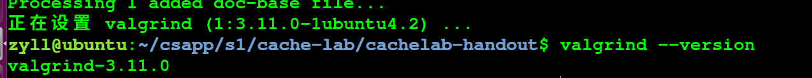
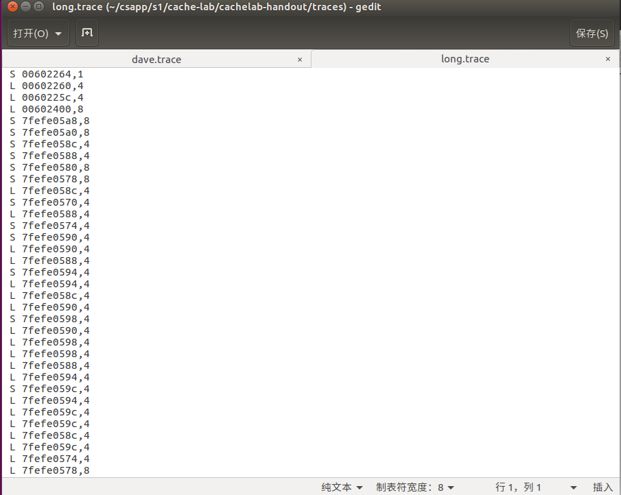
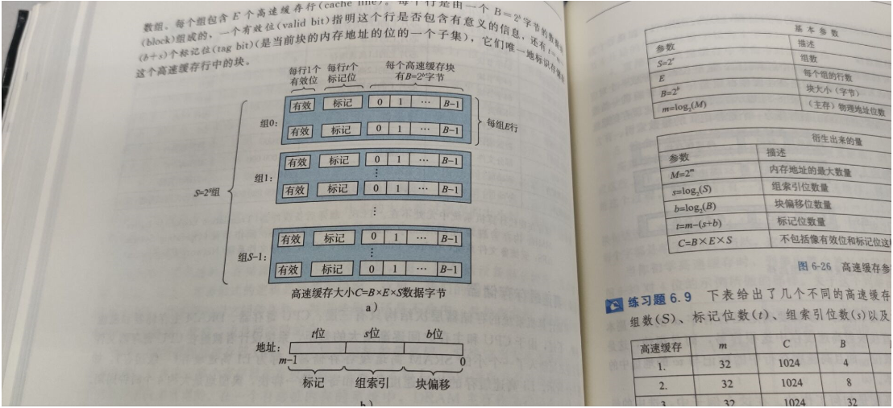
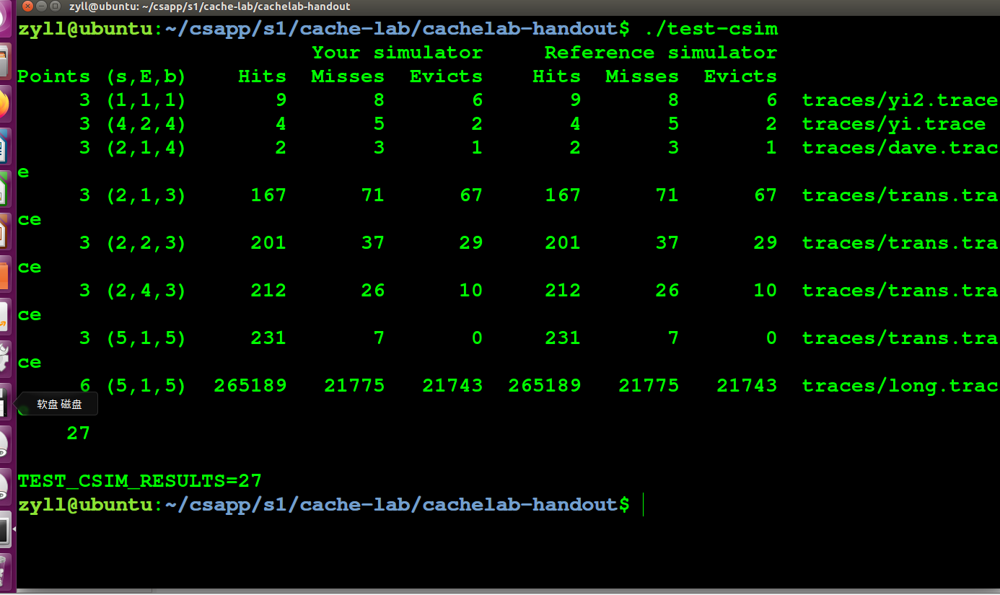
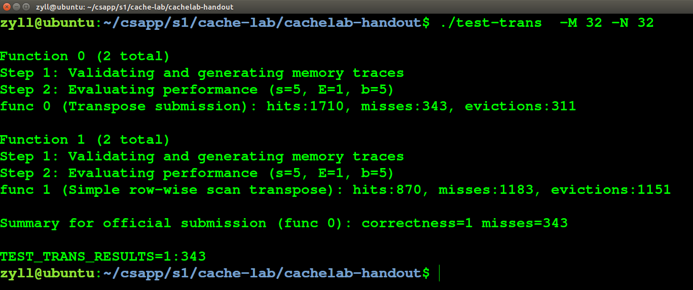
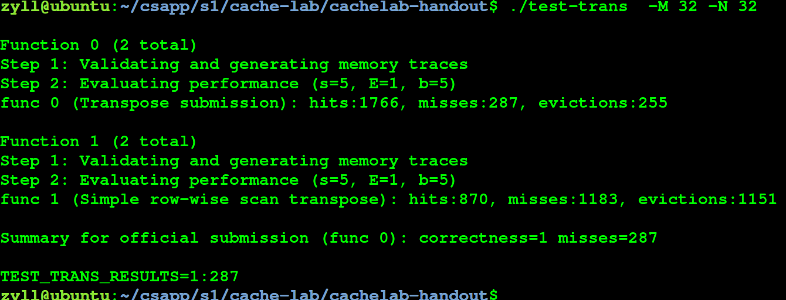
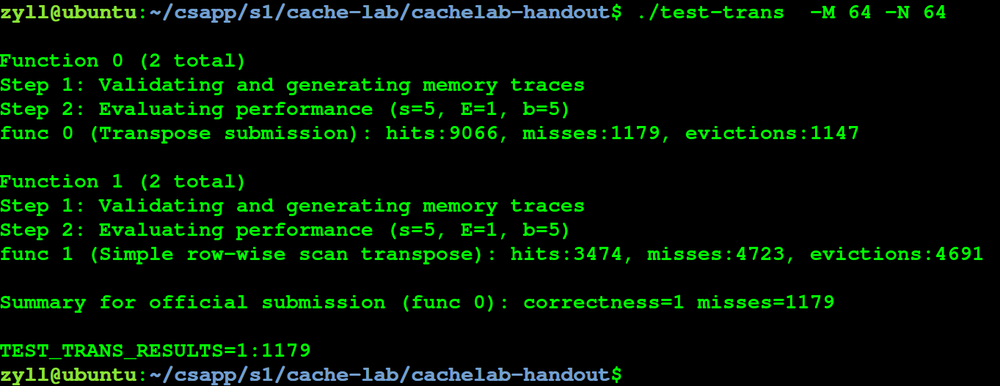

# Cachelab

cachelab一共分为两部分，PartA是模拟cache运行的过程，就是模拟cache的行为。PartB是一个矩阵转置，给出了三种规模，就是尽可能的提高高速缓存的命中率，它会根据你的miss，hits，eviction这三个值的大小进行打分，评分的范围已给出。 


 修改csim.c和trans.c，然后make构建整个项目，最后`./driver.py`进行判分，查看每个Part的得分情况 

 用到的函数：

```
getopt()函数能够帮助程序分析C语言命令行程序输入的参数 
fscanf函数能够帮助用户处理文本文件中输入的格式化数据，看这个函数就知道类似于scanf
malloc 和free 分配内存和释放
```


在实验前先装一下泄露检测工具

```
sudo apt install valgrind
```

检测一下版本型号

```
valgrind --version
```





## PartA

在这个part里需要在 csim.c 里编写一个使用LRU策略的 cache 模拟器，要求最终测试结果要和文件中给出的 csim-ref 文件的结果一样。它里面进行验证的命令存在traces文件夹里，


打开dave.crace

```
L 10,4 
S 18,4
L 20,4
S 28,4
S 50,4
```


打开long.trace




如果碰到 I 开头的命令，不用理会。代码里直接continue, LRU是被替换掉的块其最后的访问时间是距离现在最远的，体现在代码里可以设置一个时间戳，完成一次操作然后递增，替换的时候比大小就可以了。 


```
I denotes an instruction load
L a data load
S a data store
M a data modify
```


对应得数据结构




写出代码

```
#include "cachelab.h"
#include <stdlib.h>
#include <unistd.h>
#include <stdio.h>
#include <limits.h>
#include <getopt.h>
#include <string.h>

int h,v,s,E,b,S; // 这个是我们模拟的参数，为了方便在函数里调用，设置成全局

int hit_count , 
    miss_count , 
    eviction_count;  // 三个在 printSummary 函数中的参数，需要不断更新
	
char t[1000]; // 存 getopt 中选项内容，表示的是验证中需使用的trace文件名

typedef struct{
    int valid_bits;
    int tag;
    int stamp;
}cache_line, *cache_asso, **cache;  // cache 模拟器的结构。由合法位、标记位和时间戳组成

cache _cache_ = NULL;  // 声明一个空的结构体类型二维数组

// 打印 helper 内容的函数，-h 命令使用，内容可自定义
void printUsage()
{
    printf("Usage: ./csim-ref [-hv] -s <num> -E <num> -b <num> -t <file>\n"
            "Options:\n"
            "  -h         Print this help message.\n"
            "  -v         Optional verbose flag.\n"
            "  -s <num>   Number of set index bits.\n"
            "  -E <num>   Number of lines per set.\n"
            "  -b <num>   Number of block offset bits.\n"
            "  -t <file>  Trace file.\n\n"
            "Examples:\n"
            "  linux>  ./csim-ref -s 4 -E 1 -b 4 -t traces/yi.trace\n"
            "  linux>  ./csim-ref -v -s 8 -E 2 -b 4 -t traces/yi.trace\n");
}

// 初始化cache的函数
void init_cache()
{
	//多维数组的开辟要一行行malloc
        _cache_ = (cache)malloc(sizeof(cache_asso) * S); 
	for(int i = 0; i < S; ++i)
	{
		_cache_[i] = (cache_asso)malloc(sizeof(cache_line) * E);
		for(int j = 0; j < E; ++j)
		{
			_cache_[i][j].valid_bits = 0;
			_cache_[i][j].tag = -1;
			_cache_[i][j].stamp = -1;
		}
	}
}


void update(unsigned int address)
{
	// 索引地址位可以用位运算，-1U是最大整数，64是因为我电脑是64位
        int setindex_add = (address >> b) & ((-1U) >> (64 - s));
	int tag_add = address >> (b + s);
	
	int max_stamp = INT_MIN;
	int max_stamp_index = -1;

	for(int i = 0; i < E; ++i) //如果tag相同，就hit，重置时间戳
	{
		if(_cache_[setindex_add][i].tag == tag_add)
		{
			_cache_[setindex_add][i].stamp = 0;
			++hit_count;
			return ;
		}
	}
	
	for(int i = 0; i < E; ++i) // 查看有没有空行
	{
		if(_cache_[setindex_add][i].valid_bits == 0)
		{
			_cache_[setindex_add][i].valid_bits = 1;
			_cache_[setindex_add][i].tag = tag_add;
			_cache_[setindex_add][i].stamp = 0;
			++miss_count;
			return ;
		}
	}
	// 没有空行又没有hit就是要替换了
	++eviction_count;
	++miss_count;
	
	for(int i = 0; i < E; ++i)
	{
		if(_cache_[setindex_add][i].stamp > max_stamp)
		{
			max_stamp = _cache_[setindex_add][i].stamp;
			max_stamp_index = i;
		}
	}
	_cache_[setindex_add][max_stamp_index].tag = tag_add;
	_cache_[setindex_add][max_stamp_index].stamp = 0;
	return ;
}


void update_stamp()
{
	for(int i = 0; i < S; ++i)
		for(int j = 0; j < E; ++j)
			if(_cache_[i][j].valid_bits == 1)
				++_cache_[i][j].stamp;
}


void parse_trace()
{
	FILE* fp = fopen(t, "r"); // 读取文件名
	if(fp == NULL)
	{
		printf("open error");
		exit(-1);
	}
	
	char operation;         // 命令开头的 I L M S
	unsigned int address;   // 地址参数
	int size;               // 大小
	while(fscanf(fp, " %c %xu,%d\n", &operation, &address, &size) > 0)
	{
		
		switch(operation)
		{
			//case 'I': continue;	   // 不用写关于 I 的判断也可以
			case 'L':
				update(address);
				break;
			case 'M':
				update(address);  // miss的话还要进行一次storage
			case 'S':
				update(address);
		}
		update_stamp();	//更新时间戳
	}
	
	fclose(fp);
	for(int i = 0; i < S; ++i)
		free(_cache_[i]);
	free(_cache_);            // malloc 完要记得 free 并且关文件
	
}

//===============================================================

int main(int argc, char* argv[])
{
	h = 0; 
	v = 0; 
	hit_count = miss_count = eviction_count = 0;
	int opt; // 接收getopt的返回值
        
        // getopt 第三个参数中，不可省略的选项字符后要跟冒号，这里h和v可省略
	while(-1 != (opt = (getopt(argc, argv, "hvs:E:b:t:"))))
	{
		switch(opt)
		{
			case 'h':
				h = 1;
				printUsage();
				break;
			case 'v':
				v = 1;
				printUsage();
				break;
			case 's':
				s = atoi(optarg);
				break;
			case 'E':
				E = atoi(optarg);
				break;
			case 'b':
				b = atoi(optarg);
				break;
			case 't':
				strcpy(t, optarg);
				break;
			default:
				printUsage();
				break;
		}
	}
	
	if(s<=0 || E<=0 || b<=0 || t==NULL) // 如果选项参数不合格就退出
	        return -1;
	S = 1 << s;                // S=2^s
	
	FILE* fp = fopen(t, "r");
	if(fp == NULL)
	{
		printf("open error");
		exit(-1);
	}
	
	init_cache();  // 初始化cache
	parse_trace(); // 更新最终的三个参数

    printSummary(hit_count, miss_count, eviction_count);
    
    return 0;
}
```





## PartB

 我们去完成 trans.c 文件中的 transpose_submit 函数，实现矩阵的转置 。有几个要求，一是逻辑上一共只准使用不超过 12 个 int 类型局部变量，二是不能用递归，三是不准改变 A 数组的内容，但能在 B 数组里随便写，四是不能定义新的数组也不能用 malloc 函数开辟空间。最终要使得 cache miss 的次数尽可能少。 

已经给定了 cache 的参数 s = 5，b = 5 ，E = 1。那么 cache 的大小就是 32 组，每组 1 行， 每行可存储 32 字节的数据。 

 cache 一行能放 8 个，所以我们分块最好也用 8 的倍数。在 32 x 32的矩阵中，一行有 32 个 int，即 4 个 cache 行，所以 cache 一共可以存矩阵的 8 行。正好可以用长宽都为 8 的分块，不会造成冲突。那么再按 8x8 的分块写代码测试一下 


#### 32*32

```
if (M == 32)
	{
		int i, j, m, n;
		for (i = 0; i < N; i += 8)
			for (j = 0; j < M; j += 8)
				for (m = i; m < i + 8; ++m)
					for (n = j; n < j + 8; ++n)
					{
						B[n][m] = A[m][n];
					}
	}
```





这次降低到了343次，接着优化一下，除了循环需要的 4 个变量外我们还剩余 8 个自由变量可以用，正好可以存一个 cache line。以空间换时间，把一行一次性读完，减少冲突不命中。


```
if(M == 32)
	{
		int i, j, k, v1, v2, v3, v4, v5, v6, v7, v8;
		for (i = 0; i < 32; i += 8)
			for(j = 0; j < 32; j += 8)
				for(k = i; k < (i + 8); ++k)
				{
					v1 = A[k][j];
					v2 = A[k][j+1];
					v3 = A[k][j+2];
					v4 = A[k][j+3];
					v5 = A[k][j+4];
					v6 = A[k][j+5];
					v7 = A[k][j+6];			
					v8 = A[k][j+7];
					B[j][k] = v1;
					B[j+1][k] = v2;
					B[j+2][k] = v3;
					B[j+3][k] = v4;
					B[j+4][k] = v5;
					B[j+5][k] = v6;
					B[j+6][k] = v7;
					B[j+7][k] = v8;
				}
	}
```


再测试




#### 64*64

写出代码


```
else if (M == 64)
	{
		int i, j, x, y;
		int x1, x2, x3, x4, x5, x6, x7, x8;
		for (i = 0; i < N; i += 8)
			for (j = 0; j < M; j += 8)
			{
				for (x = i; x < i + 4; ++x)
				{
					x1 = A[x][j]; x2 = A[x][j+1]; x3 = A[x][j+2]; x4 = A[x][j+3];
					x5 = A[x][j+4]; x6 = A[x][j+5]; x7 = A[x][j+6]; x8 = A[x][j+7];
					
					B[j][x] = x1; B[j+1][x] = x2; B[j+2][x] = x3; B[j+3][x] = x4;
					B[j][x+4] = x5; B[j+1][x+4] = x6; B[j+2][x+4] = x7; B[j+3][x+4] = x8;
				}
				for (y = j; y < j + 4; ++y)
				{
					x1 = A[i+4][y]; x2 = A[i+5][y]; x3 = A[i+6][y]; x4 = A[i+7][y];
					x5 = B[y][i+4]; x6 = B[y][i+5]; x7 = B[y][i+6]; x8 = B[y][i+7];
					
					B[y][i+4] = x1; B[y][i+5] = x2; B[y][i+6] = x3; B[y][i+7] = x4;
					B[y+4][i] = x5; B[y+4][i+1] = x6; B[y+4][i+2] = x7; B[y+4][i+3] = x8;
				}
				for (x = i + 4; x < i + 8; ++x)
				{
					x1 = A[x][j+4]; x2 = A[x][j+5]; x3 = A[x][j+6]; x4 = A[x][j+7];
					B[j+4][x] = x1; B[j+5][x] = x2; B[j+6][x] = x3; B[j+7][x] = x4;
				}
			}
	}
```





降低到了1179