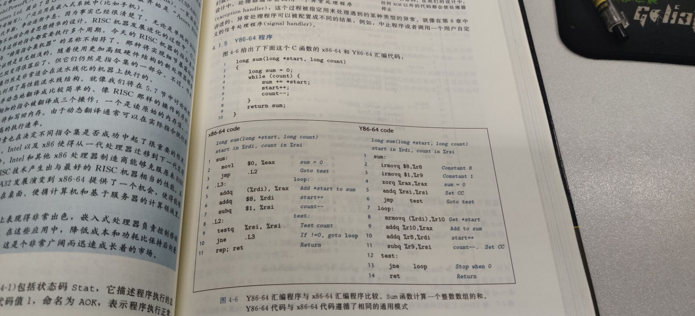
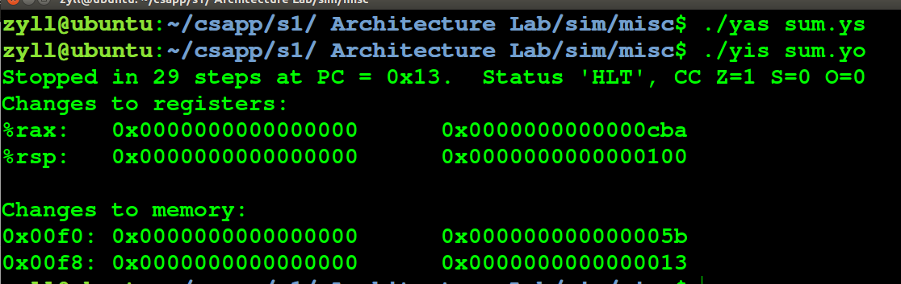
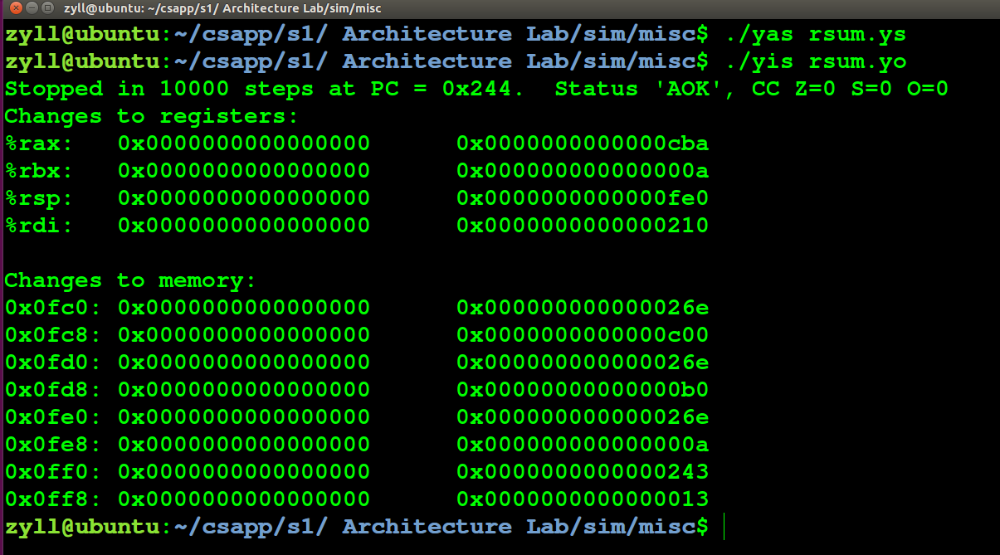
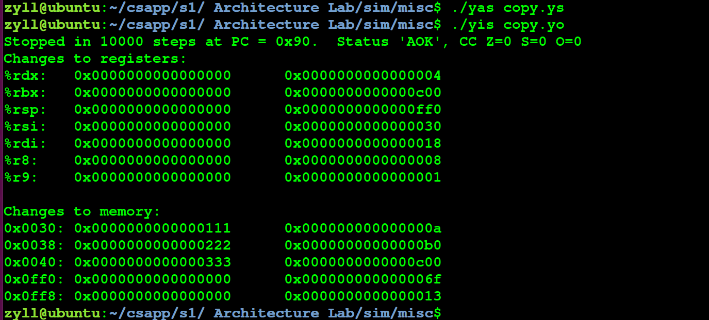
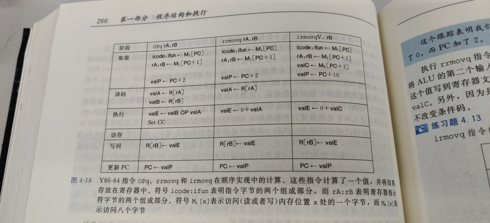
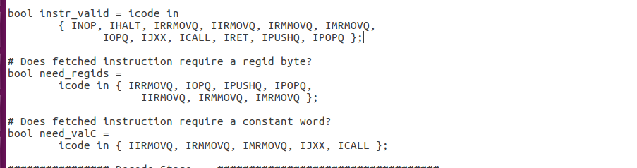
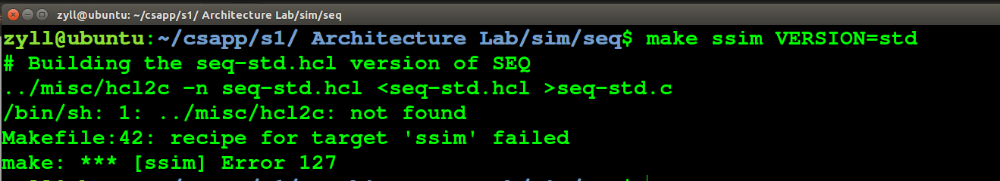

#  Architecture Lab

第四个实验中，我们需要修改处理器的HCL描述来增加新的指令、修改循环策略等，修改后的处理器能够被模拟，并通过运行自动化测试检测。 


```
Part A 是一个练手的题目，用来熟悉 Y86-64 工具。
Part B 允许你对 SEQ simulator 扩展一个新的命令。
Part C 是这个 Lab 的核心，前两个 Part 都是为这个 Part 做准备的，在这个 Part 中来优化 Lab 提供的 Y86-64 benchmark program 和处理器设计。
```


## Part A

实验中的任务为在`sim/misc`文件夹中，运用Y86指令撰写并且模拟example.c文件中的三个函数的功能。并且运用YAS进行编译，运用YIS进行运行。Y86汇编程序的编写规则见CSAPP书本的P237页，Y86程序 


先把make缺少的东西补上

```
sudo apt-get install tcl8.5-dev tk8.5-dev flex
```


 构建 Y86-64 工具的指令

```
cd sim
make clean
make
```


 Y86-64指令集概括为: 

```
RF:程序寄存器
rax,rbx,rcd,rdx,
rsp,rbp,rsi,rdi,
r8~r14

CC:条件码
ZF,SF,OF

指令集:
halt
nop
rrmovq
irmovq
rmmovq
mrmovq
OPq(subq,addq,andq,xorq)
jXX(jmp,jle,jl,je,jne,jge,jg)
cmovXX(le,l,e,ne,ge,g)
call
ret
pushq
popq
```


### sum_list

第一个函数是一个while循环加和函数，就是计算链表的元素之和

```
typedef struct ELE {
    long val;
    struct ELE *next;
} *list_ptr;

/* sum_list - Sum the elements of a linked list */
long sum_list(list_ptr ls)
{
    long val = 0;
    while (ls) {
	val += ls->val;
	ls = ls->next;
    }
    return val;
}
```


3组元素的值

```
# Sample linked list
        .align 8
ele1:
        .quad 0x00a
        .quad ele2
ele2:
        .quad 0x0b0
        .quad ele3
ele3:
        .quad 0xc00
        .quad 0
```


和书中的例子很像




所以写出代码

```
# sum_list.ys by name1e5s
# Execution begins at address 0

        .pos 0
        irmovq stack,%rsp        设置stack pointer，也就是堆栈指针
        call main                运行主函数
        halt                     结束进程

# Sample linked list             3组元素的值
        .align 8
        ele1:
        .quad 0x00a
        .quad ele2
        ele2:
        .quad 0x0b0
        .quad ele3
        ele3:
        .quad 0xc00
        .quad 0

main:	irmovq ele1,%rdi         用%rdi来传参数
        call sum_list            调用sum_list函数 
	    ret                      结束

sum_list:
	    irmovq $0,%rax           将rax的值设为0  
	    jmp test                 跳转到test
loop:	mrmovq 0(%rdi),%rsi       
        addq %rsi,%rax           加和
        mrmovq 8(%rdi),%rsi      指针指向下一个值 
        rrmovq %rsi,%rdi
test:   andq %rdi,%rdi           判断rdi是否为0
        jne loop                 不为0就继续循环跳到loop
        ret

        .pos 0x100
stack:
```


然后在文件夹几面创建文件sum.ys，把汇编代码放入文件，再执行测试口令


测试指令

```
./yas sum.ys
./yis sum.yo
```


得到




最后%rax的值就是三个数的和0xcba

### rusm_list

代码为

```
long rsum_list(list_ptr ls)
{
    if (!ls)
	return 0;
    else {
	long val = ls->val;
	long rest = rsum_list(ls->next);
	return val + rest;
    }
}
```


第二个函数和第一个很像，是sum_list的递归，

```
#init function
    .pos 0x0
    irmovq stack,%rsp           设置堆栈指针
    call main                   执行主函数
    ret                          

# Sample linked list 
    .pos 0x200
    .align 8
ele1:
    .quad 0x00a
    .quad ele2
ele2:
    .quad 0x0b0
    .quad ele3
ele3:
    .quad 0xc00
    .quad 0

# main function
main:
    irmovq ele1,%rdi            用rdi传参
    call rsum_list              执行rsum_list函数
    ret

# rsum_list function
rsum_list:
    andq %rdi,%rdi              把rdi清0
    je L1                       等于0就跳到L1
    mrmovq (%rdi),%rbx          把rdi附给rax
    mrmovq 8(%rdi),%rdi         取出rdi的下一位
    pushq %rbx                  把rbx压入栈中
    call rsum_list              递归运行rsum_list函数
    popq %rbx                   弹出rbx
    addq %rbx,%rax              rax=rax+rbx
    ret
L1:
    irmovq $0,%rax              rax=0
    ret

#alloc stack space
    .pos 0x1000
stack:
```


验证

```
./yas rsum.ys
./yis rsum.yo
```





### copy_block

 将内存中的一块数据拷贝到另一个不重叠的内存位置，并计算被拷贝数据的 **checksum(Xor)** 

```
long copy_block(long *src, long *dest, long len)
{
    long result = 0;
    while (len > 0) {
	long val = *src++;
	*dest++ = val;
	result ^= val;
	len--;
    }
    return result;
}
/* $end examples */

```


和上面的相比，多了一个异或

```
#init function
    .pos 0x0
    irmovq stack,%rsp        设置堆栈指针rsp
    call main                执行主函数
    ret

.align 8
# Source block
src:
.quad 0x00a
.quad 0x0b0
.quad 0xc00
# Destination block
dest:
.quad 0x111
.quad 0x222
.quad 0x333


# main function
main:
    irmovq src,%rdi          把src的数据附给rdi
    irmovq dest,%rsi         把dest的数据附给rsi       
    irmovq $3,%rdx           调用函数之前准备好的参数
    call copy_block          执行copy_block函数
    ret

# copy_block function
copy_block:
    irmovq $8,%r8            r8=8
    irmovq $1,%r9            r9=1
    irmovq $0,%rax           rax=0
    addq %r9,%rdx            rdx=rdx+r9
    jmp L2                   跳到L2
L1:
    mrmovq (%rdi),%rbx       rbx=rdi，传入参数
    addq %r8,%rdi            取出rdi的下一位
    rmmovq %rbx,(%rsi)       rsi=rbx
    addq %r8,%rsi            取出rsi的下一位
    xorq %rbx,%rax           rax=rax^rbx
L2:
    subq %r9,%rdx            rdx=rdx-1
    jne L1                   rdx不等于0就跳到L1
    ret

#alloc stack space
    .pos 0x1000
stack:

```


```
./yas copy.ys
./yis copy.yo
```





## PartB

题目在目录 **sim/seq** 里 

任务就是扩展 SEQ Processor，通过修改 seq-full.hcl 文档，使其支持 iaddq 命令。 


书里面的图




 iaddq 命令的五阶段描述 

```
Fetch： icode :ifun ← M1[PC] rA :rB ← M1[PC + 1] valC ← M8[PC + 2] valP ← PC + 10
Decode： valB ← R[rB]
Excute： valE ← valB + valC Set CC
Memory： 无
Write back： R[rB] ← valE
PC Update： PC ← valP
```


 在seq-full.hcl文件里搜索IRRMOVQ和IOPQ相关项并修改




在关键部分后面加IIADDQ

```
bool instr_valid = icode in 
 	{ INOP, IHALT, IRRMOVQ, IIRMOVQ, IRMMOVQ, IMRMOVQ,
-	       IOPQ, IJXX, ICALL, IRET, IPUSHQ, IPOPQ };
+	       IOPQ, IJXX, ICALL, IRET, IPUSHQ, IPOPQ, IIADDQ };   是否是合法指令
 
 # Does fetched instruction require a regid byte?
 bool need_regids =
 	icode in { IRRMOVQ, IOPQ, IPUSHQ, IPOPQ, 
-		     IIRMOVQ, IRMMOVQ, IMRMOVQ };
+		     IIRMOVQ, IRMMOVQ, IMRMOVQ, IIADDQ };    是否需要寄存器
 
 # Does fetched instruction require a constant word?
 bool need_valC =
-	icode in { IIRMOVQ, IRMMOVQ, IMRMOVQ, IJXX, ICALL };
+	icode in { IIRMOVQ, IRMMOVQ, IMRMOVQ, IJXX, ICALL, IIADDQ }; 是否需要立即数
 
 ################ Decode Stage    ###################################
 
@@ -128,7 +128,7 @@
 
 ## What register should be used as the B source?
 word srcB = [
-	icode in { IOPQ, IRMMOVQ, IMRMOVQ  } : rB;
+	icode in { IOPQ, IRMMOVQ, IMRMOVQ, IIADDQ  } : rB;
 	icode in { IPUSHQ, IPOPQ, ICALL, IRET } : RRSP;
 	1 : RNONE;  # Don't need register
 ];
@@ -136,7 +136,7 @@
 ## What register should be used as the E destination?
 word dstE = [
 	icode in { IRRMOVQ } && Cnd : rB;
-	icode in { IIRMOVQ, IOPQ} : rB;
+	icode in { IIRMOVQ, IOPQ, IIADDQ} : rB;
 	icode in { IPUSHQ, IPOPQ, ICALL, IRET } : RRSP;
 	1 : RNONE;  # Don't write any register
 ];
@@ -152,7 +152,7 @@
 ## Select input A to ALU
 word aluA = [
 	icode in { IRRMOVQ, IOPQ } : valA;
-	icode in { IIRMOVQ, IRMMOVQ, IMRMOVQ } : valC;
+	icode in { IIRMOVQ, IRMMOVQ, IMRMOVQ, IIADDQ } : valC;
 	icode in { ICALL, IPUSHQ } : -8;
 	icode in { IRET, IPOPQ } : 8;
 	# Other instructions don't need ALU
@@ -161,7 +161,7 @@
 ## Select input B to ALU
 word aluB = [
 	icode in { IRMMOVQ, IMRMOVQ, IOPQ, ICALL, 
-		      IPUSHQ, IRET, IPOPQ } : valB;
+		      IPUSHQ, IRET, IPOPQ, IIADDQ } : valB;
```

改完之后输入

```
make ssim VERSION=std
```

然后报错了，不知道怎么改




## Part C

 C主要在sim/pipe文件夹下，任务为修改ncopy.ys和pipe-full.hcl 文件使得ncopy.ys 的运行速度越快越好。 pipe-full.hcl 实现iaddl指令 ，直接模仿上面的就行


修改 ncopy.ys 

```
# You can modify this portion
# Loop Header
        xorl    %eax , %eax
        iaddl   $-4 , %edx #len = len -4
        andl    %edx ,  %edx    
        jl  remian
Loop:   mrmovl (%ebx) , %esi
        mrmovl 4(%ebx),%edi
        rmmovl %esi , (%ecx)
        andl    %esi ,%esi
        jle LNpos1
        iaddl   $1 , %eax
LNpos1: rmmovl %edi , 4(%ecx)
        andl    %edi , %edi
        jle     LNpos2
        iaddl   $1, %eax
LNpos2:mrmovl 8(%ebx) , %esi
        mrmovl 12(%ebx),%edi
        rmmovl %esi ,8 (%ecx)
        andl    %esi ,%esi
        jle LNpos3
        iaddl   $1 , %eax
LNpos3: rmmovl %edi , 12(%ecx)
        andl    %edi , %edi
        jle     nextLoop
        iaddl   $1, %eax
nextLoop:
        iaddl   $16,%ebx
        iaddl   $16,%ecx
        iaddl   $-4,%edx
        jge Loop            

# maybe just remain less than 3
remian:  iaddl  $4 , %edx  # Restore the true len
        iaddl   $-1, %edx
        jl  Done
        mrmovl (%ebx) , %esi
        mrmovl 4(%ebx),%edi
        rmmovl %esi , (%ecx)
        andl    %esi ,%esi
        jle rNpos
        iaddl   $1 , %eax
rNpos:  
        iaddl   $-1, %edx
        jl  Done
        rmmovl  %edi , 4(%ecx)
        andl    %edi , %edi
        jle     rNpos1
        iaddl   $1, %eax
rNpos1:
        iaddl   $-1 , %edx 
        jl  Done
        mrmovl 8(%ebx) , %esi
        rmmovl %esi , 8(%ecx)
        andl    %esi ,%esi
        jle Done
        iaddl   $1 , %eax
```


再 ./correctness.pl 来验证，第三个没有太明白